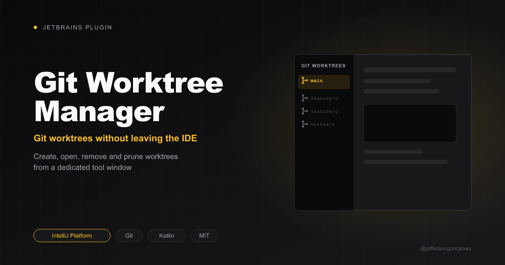

# Git Worktree Manager for JetBrains IDEs

[](https://buymeacoffee.com/jeffersongoncalves)

[](https://plugins.jetbrains.com/plugin/34860-jsg-worktree-manager)
[](https://plugins.jetbrains.com/plugin/34860-jsg-worktree-manager)

> Create and manage git worktrees without leaving your JetBrains IDE.

**JSG Worktree Manager** adds a *Git Worktrees* tool window and VCS menu actions for `git worktree` to every JetBrains IDE (IntelliJ IDEA, PhpStorm, WebStorm, PyCharm, GoLand, ...). It is the JetBrains port of the [JSG Git Worktree Manager](https://github.com/jeffersongoncalves/git-worktree-manager-vscode) VS Code extension.

- **Homepage**: [GitHub](https://github.com/jeffersongoncalves/git-worktree-manager-plugin)
- **Marketplace**: [JetBrains Marketplace](https://plugins.jetbrains.com/plugin/34860-jsg-worktree-manager)
- **Issues**: [GitHub Issues](https://github.com/jeffersongoncalves/git-worktree-manager-plugin/issues)

## Features

- **Create worktree from existing branch** — pick a local or remote branch, confirm the destination path, then open the new worktree.
- **Create worktree with a new branch** — name a new branch, pick its base branch and check it out into a new worktree.
- **Git Worktrees tool window** — every worktree of the repository, with the main worktree highlighted and locked/prunable badges. Double-click opens a worktree.
- **Open / copy path / remove / prune** — from the tool window toolbar. Removing a dirty or locked worktree offers a force remove.

## Requirements

- Any JetBrains IDE 2024.3+ (builds 243–263.*)
- `git` available on the PATH
- The project must be inside a git repository

## Installation

### From JetBrains Marketplace

**Settings → Plugins → Marketplace**, search for **"JSG Worktree Manager"** and click **Install**.

### From Disk

1. Download the latest `.zip` from [Releases](https://github.com/jeffersongoncalves/git-worktree-manager-plugin/releases)
2. **Settings → Plugins → ⚙️ → Install Plugin from Disk...**
3. Select the `.zip` file and restart the IDE

## Usage

Open the **Git Worktrees** tool window (left sidebar, or **View → Tool Windows → Git Worktrees**), or use **VCS → Git Worktrees**:

| Action | Description |
|---|---|
| Create Worktree from Existing Branch... | `git worktree add <path> <branch>` |
| Create Worktree with New Branch... | `git worktree add -b <new-branch> <path> <base>` |
| Refresh Worktrees | Reload the list |
| Prune Worktrees | `git worktree prune` |
| Open Worktree | Open in a new window or in this window (tool window) |
| Copy Path | Copy the worktree path to the clipboard (tool window) |
| Remove Worktree | `git worktree remove`, with `--force` fallback (tool window) |

New worktrees are suggested at `<repo>/<base directory>/<repo name>-<branch>`, e.g. `../my-app-login` for `feature/login`.

## Settings

**Settings → Tools → Git Worktree Manager**:

| Setting | Default | Description |
|---|---|---|
| Default base directory | `../` | Base directory (relative to the repository) for suggested worktree paths |
| After creating a worktree | Ask every time | Open in a new window, in this window, don't open, or ask |
| Confirm remove | on | Ask for confirmation before removing a worktree |

## Building from Source

```bash
git clone git@github.com:jeffersongoncalves/git-worktree-manager-plugin.git
cd git-worktree-manager-plugin

./gradlew buildPlugin   # build/distributions/*.zip
./gradlew runIde        # sandbox IDE with the plugin loaded
./gradlew test          # unit tests
./gradlew verifyPlugin  # compatibility check
```

## License

[MIT](LICENSE)

## Author

**Jefferson Goncalves** — [GitHub](https://github.com/jeffersongoncalves)
